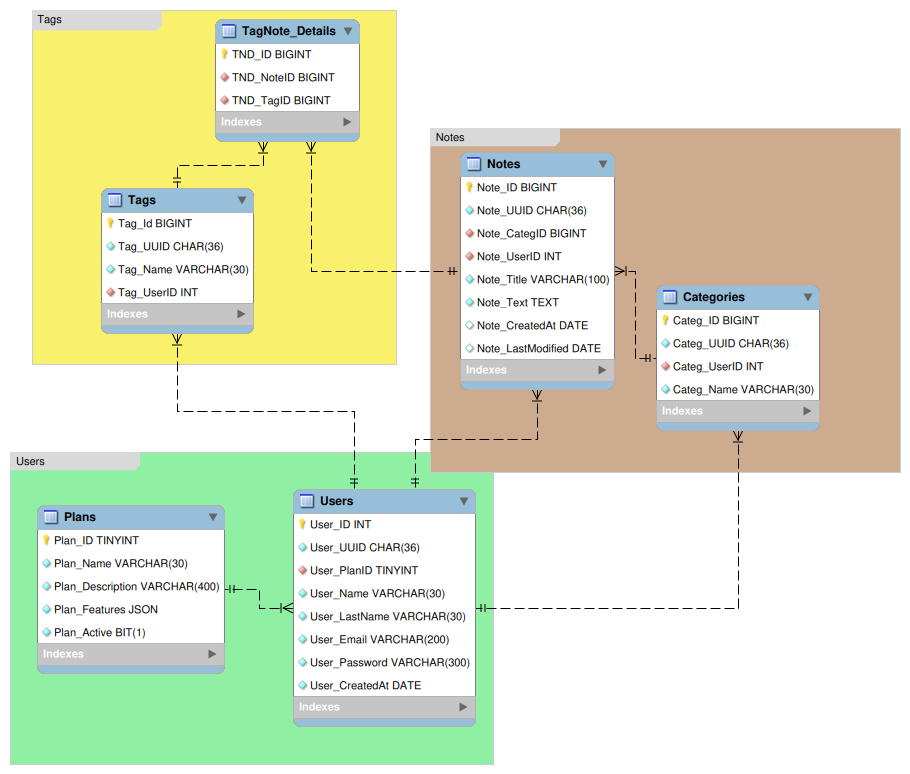
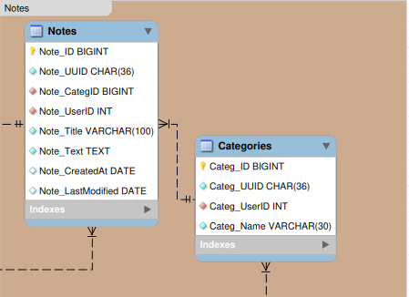
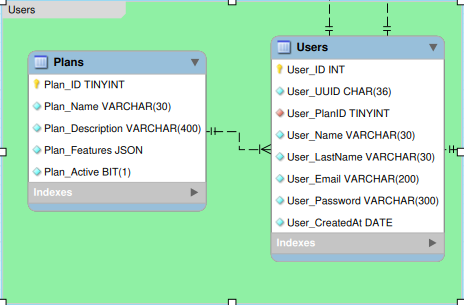
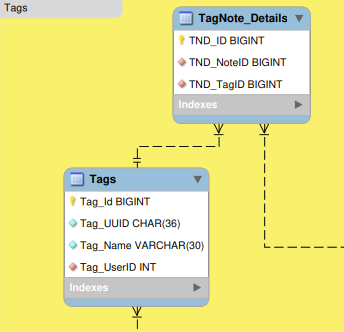

# Database - Notes System

This database is designed for storing and managing data related to notes and user who manage them. It includes the neccesary elements that a database for a note application should handle in order to offer a good user experience.

## Tecnologies

+ `mysql-community 8.0.35`
+ `fedora-workstation 38`
+ `bash 5.2.21`

## Instalation

Clone this repo

```bash
# clone the repo
git clone git@github.com/JhonatanMustiolaCas/notes-system-db.git
# go to the src directory
cd notes-system-db/src/
```

Then configure your mysql access information in the `config.cnf` file

```conf
[client]
user="user"
password="password"
host="server"
```

Execute the `setup.sh` script

```bash
# Grant execution permission to the file
sudo chmod u+x ./setup.sh
# Execute the script
./setup.sh
```

You can also do it manually from mysql-cli or your MySQL client. MySQL Workbench is recommended.

>[!NOTE]
> The names of the sql scripts have a numerical prefix that indicates the order in which they should be executed

## Preview



This is an overview of the database design. In it you can notice layers, which will be presented one by one after this section.

****
|Table|Description|
|---|---|
|Plans|Contains information about pricing plans|
|Users|Contains essential information for a user system database|
|Categories|Contains categories by user for notes categorying|
|Notes|Contains essential notes informations by user|
|Tag|Contains tags by user|
|TagNote_Details|Contains tags by note|

## Layers

*Notes* Layer



****

*Users* Layer



****

*Tags* Layer



## Contribute

I will soon start adding functions, stored procedures, events and other things. Adding any of those functionalities it's one the best ways you could contribute. And also, if you have any recommendation, so I'd like too much you let me know it.

General steps for making a pull request in this repo:

+ Clone this repo
+ Define a functionality in a sql script and try adding it in your local DB instance
+ If all goes well, make a Pull Request in the format `[name]-[type]-add`
+ Each sql script will be in a directory with the name of the type: `functions`, `stored-procedures`, `events`, etc. If the directory does not exist you must create it

## Final

+ Give a **star** if this repo has been useful for you
